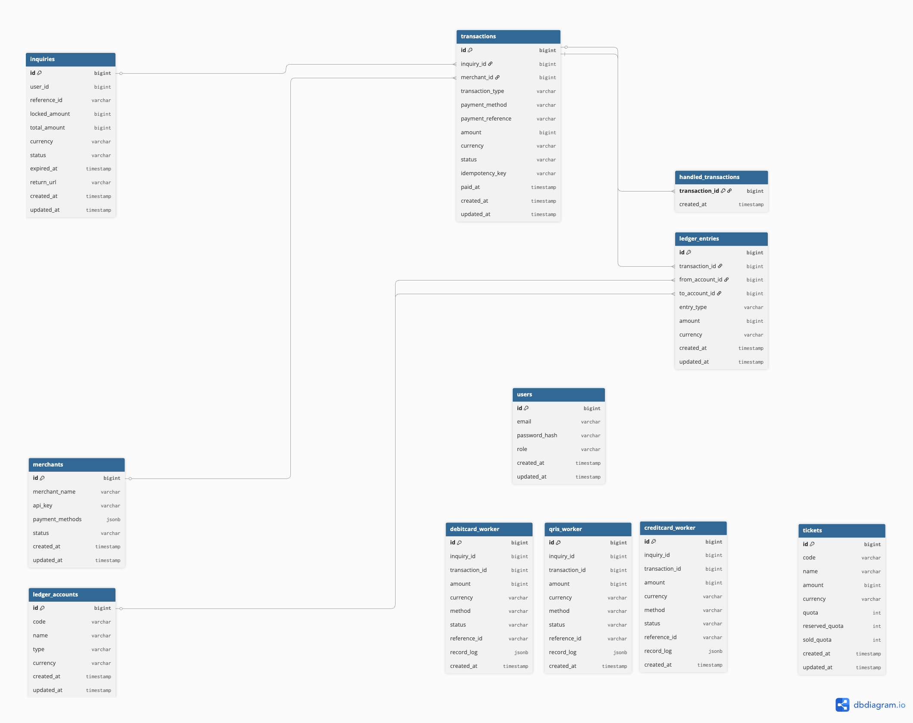

## Access URL

The application is exposed via HTTPS tunnel for evaluation:

https://rizkyiann8nautomation.my.id/ [Currently Using My domain. since other domain still propagate]

Note:
Custom domain + Cloudflare + cert-manager (DNS-01) is configured,
but registrar DNS propagation exceeded assignment time constraints.

## Architecture Diagram

```
┌─────────────────────────────────────────────────────────────────┐
│                         USER BROWSER                            │
│                                                                 │
│                  React Single Page Application                  │
│                  (Ticket Selection & Checkout)                  │
└────────────────────────┬────────────────────────────────────────┘
                         │ HTTPS/REST
                         ▼
┌─────────────────────────────────────────────────────────────────┐
│                      TICKET SERVICE                             │
│                         (C# .NET)                               │
│                                                                 │
│  • Ticket availability validation                               │
│  • Order creation & management                                  │
│  • Initiates payment processing                                 │
└───────────┬─────────────────────────────────────────────────────┘
            │ will redirect to checkout then 
            ▼
┌───────────────────────────────────────────────────────────────┐
│                   PAYMENT SERVICE                             │
│                   (Node.js (NestJS))                          │
│                                                               │
│  • Payment method routing                                     │
│  • Enqueues payment job to worker                             │
│  • Returns job ID immediately (async)                         │
└───────────┬───────────────────────────────────────────────────┘
            │ Enqueue Job
            ▼
┌───────────────────────────────────────────────────────────────┐
│                   PAYMENT WORKER (Golang)                     │
│                   (Background Job Queue )                     │
│                                                               │
│  • Processes payment asynchronously                           │
│  • Calls external payment gateway                             │
│  • Handles retries & failures                                 │
│  • Updates payment status                                     │
└───────────┬──────────────────────┬────────────────────────────┘
            │                      │
            │ Call Gateway         │ Listen for webhooks
            ▼ response             ▼
┌───────────────────────┐   ┌───────────────────────────────────┐
│  External Payment     │   │   WEBHOOK ENDPOINT                │
│  Gateway              │   │   (Payment Service)               │
│                       │   │                                   │
│  • Process payment    │   │  • Receive payment confirmation   │
│  • Send webhook       │   │  • Verify signature               │
└───────────────────────┘   │  • Trigger ledger recording       │
                            └──────────┬────────────────────────┘
                                        │ REST
                                        ▼
                             ┌──────────────────────────────────┐
                             │   LEDGER SERVICE                 │
                             │   (Python Fast API)              │
                             │                                  │
                             │  • Double-entry accounting       │
                             │  • Transaction recording         │
                             │  • Audit trail generation        │
                             │  • Immutable ledger entries      │
                             └──────────┬───────────────────────┘
                                        │
                                        ▼
                             ┌──────────────────────────────────┐
                             │   PostgreSQL / MySQL             │
                             │                                  │
                             │  • tickets                       │
                             │  • orders                        │
                             │  • payment_jobs                  │
                             │  • ledger_entries                │
                             └──────────────────────────────────┘
```

## Database Diagram




## Service Responsibilities

### Ticket Service (C# .NET)

**Primary Responsibilities**

- Manage ticket inventory and quota enforcement
- Handle order creation and validation
- Orchestrate payment and ledger workflows
- Return consolidated responses to frontend

**API Endpoints**

- `GET /api/ticket` - List available ticket types with current quotas
- `POST /api/inquiry/submit` - Create order and process payment
- `GET /api/inquiry/{id}` - Retrieve order details

**Key Logic**

- Atomic quota decrement using database transactions
- Rollback handling if payment or ledger recording fails
- Order reference generation (unique identifier)

---

### Payment Service (Node.js / Golang)

**Primary Responsibilities**

- Route payment requests to appropriate handlers
- Simulate payment gateway interactions
- Enforce idempotency to prevent duplicate charges
- Generate transaction IDs and payment references

**Payment Method Handlers**

| Method | Behavior | Processing Time |
| --- | --- | --- |
| Credit Card | Instant success simulation | Immediate |
| QR/UPI/QRIS | Artificial delay simulation | 8 seconds |

**Design Pattern: Strategy Pattern**

```
PaymentInterface
├── CreditCardHandler
│   └── processPayment(amount, metadata)
├── QRPaymentHandler
│   └── processPayment(amount, metadata)
└── [Future: WalletHandler, BankTransferHandler, CryptoHandler]
```

**Idempotency Implementation**

- Client sends idempotency key with payment request
- Service checks if transaction with same key already exists
- Returns existing transaction if found, prevents duplicate processing

---

### Ledger Service (Python FAST API)

**Primary Responsibilities**

- Record all financial transactions
- Enforce double-entry accounting principles
- Maintain immutable audit trail
- Validate ledger balance integrity

**Double-Entry Accounting Model**

For each successful payment:

```
Debit:  Cash / Payment Gateway Account    AED XXX
Credit: Ticket Sales Revenue              AED XXX
```

**Guarantees**

- Every transaction has equal debits and credits
- No orphaned or unbalanced entries
- Chronological ordering with timestamps
- Immutability (no updates, only inserts)

---

##

## How to Run Locally

### Prerequisites

- Docker & Docker Compose installed
- Node.js 18+ (for frontend local development)
- Git

### Step 1: Clone Repository

```bash
git clone <repository-url>
cd e-ticketing-platform
```

### Step 2: Environment Setup

Create `.env` file in project root:

```bash
# Database
you'll find environment variables examples in each service
```

### Step 3: Start PG and RabbitMQ with Docker Compose

```bash
docker-compose up -d
```

This will start:

- PostgreSQL database (port 5432)
- RabbitMQ (port 5672w)

### Step 4: Database Migration

```bash
# Run migrations
folder called init_mgrations you can copy that and backup in the postgres
```


## How to Deploy

### Deployment Architecture

**Target Environment**

- AWS EC2 t2.micro or t3.micro (free tier eligible)
- K3s (lightweight Kubernetes)
- Nginx ingress controller
- Let's Encrypt for TLS certificates

### Prerequisites

- AWS account with EC2 instance running Ubuntu 22.04
- Domain name (free options: Freenom, DuckDNS)
- SSH access to EC2 instance

### Step 1: Provision EC2 Instance

```bash
# Launch EC2 instance
# Instance Type: t2.micro
# AMI: Ubuntu 22.04 LTS
# Security Group: Allow ports 22, 80, 443, 6443

# SSH into instance
ssh -i your-key.pem ubuntu@your-ec2-public-ip
```

### Step 2: Install K3s

```bash
curl -sfL https://get.k3s.io | sh -

# Verify installation
sudo k3s kubectl get nodes
```

### Step 3: Configure DNS

Point your domain to EC2 public IP:

```
A Record: ticketing.yourdomain.com -> EC2_PUBLIC_IP
```

### Step 4: Deploy Services

```bash
# Create namespace
kubectl create namespace ticketing

# Create secrets
kubectl create secret generic api-credentials \
  --from-literal=api-key=your-secret-api-key \
  --from-literal=client-id=client-12345 \
  --from-literal=client-secret=secret-67890 \
  -n ticketing

# Apply Kubernetes manifests
kubectl apply -f k8s/database.yaml
kubectl apply -f k8s/ticket-service.yaml
kubectl apply -f k8s/payment-service.yaml
kubectl apply -f k8s/ledger-service.yaml
kubectl apply -f k8s/frontend.yaml
kubectl apply -f k8s/ingress.yaml
```

### Step 5: Configure TLS with Let's Encrypt

```bash
# Install cert-manager
kubectl apply -f https://github.com/cert-manager/cert-manager/releases/download/v1.13.0/cert-manager.yaml

# Apply certificate issuer
kubectl apply -f k8s/letsencrypt-issuer.yaml
```

### Step 6: Verify Deployment

```bash
# Check pod status
kubectl get pods -n ticketing

# Check ingress
kubectl get ingress -n ticketing

# Access application
https://ticketing.yourdomain.com
```

### Alternative: Docker Compose Deployment

For simpler deployment without Kubernetes:

```bash
# On EC2 instance
git clone <repository-url>
cd e-ticketing-platform

# Set environment variables
cp .env.example .env.production
nano .env.production  # Edit values

# Start services
docker-compose -f docker-compose.prod.yaml up -d

# Setup nginx reverse proxy
sudo apt install nginx
sudo cp nginx/ticketing.conf /etc/nginx/sites-available/
sudo ln -s /etc/nginx/sites-available/ticketing.conf /etc/nginx/sites-enabled/
sudo nginx -t
sudo systemctl reload nginx

# Setup SSL with certbot
sudo apt install certbot python3-certbot-nginx
sudo certbot --nginx -d ticketing.yourdomain.com
```


## CI/CD Pipeline Explanation

### Current Pipeline

The project uses **GitHub Actions** for continuous integration and deployment.

**Pipeline Stages**

```
┌──────────────┐
│ Code Push    │
│ to main      │
└──────┬───────┘
       │
       ▼
┌──────────────┐
│ 1. Lint      │  ESLint, Prettier, StyleCop
└──────┬───────┘
       │
       ▼
┌──────────────┐
│ 2. Build     │  .NET build, npm build, Python venv
└──────┬───────┘
       │
       ▼
┌──────────────┐
│ 3. Test      │  Unit tests, Integration tests
└──────┬───────┘
       │
       ▼
┌──────────────┐
│ 4. Docker    │  Build images for all services
│    Build     │
└──────┬───────┘
       │
       ▼
┌──────────────┐
│ 5. Tag       │  Tag with commit hash
│              │  Format: service-name:abc1234
└──────┬───────┘
       │
       ▼
┌──────────────┐
│ 6. Push      │  Push to Docker Hub / ECR
└──────┬───────┘
       │
       ▼
┌──────────────┐
│ 7. Deploy    │  Update K8s deployments (optional)
└──────────────┘
```

### Known Limitations

**Current Approach**

- Images tagged only with commit hash
- Sequential build and push (slower for multiple services)
- No semantic versioning

**Impact**

- Difficult to identify production versions
- Longer pipeline execution time
- Manual version tracking required

### Planned Improvements

**Semantic Versioning**

```bash
# Future tagging strategy
service-name:v1.2.3
service-name:v1.2.3-abc1234
service-name:latest
```

**Parallel Builds**

```yaml
jobs:
  build-ticket-service:
    runs-on: ubuntu-latest
    steps: [...]
  
  build-payment-service:
    runs-on: ubuntu-latest
    steps: [...]
  
  build-ledger-service:
    runs-on: ubuntu-latest
    steps: [...]
```

**Multi-Stage Dockerfiles**

- Smaller final images
- Faster build times with caching
- Security scanning integration

---

##

## Assumptions & Trade-offs

### Assumptions

**Business Assumptions**

- All payments succeed (no failure simulation required for MVP)
- Refunds not implemented in initial version
- Single currency (AED) supported
- No partial payments or installments
- Quota managed at service level (no distributed locking)

**Technical Assumptions**

- Synchronous communication acceptable for MVP latency requirements
- Single database instance sufficient (no read replicas yet)
- API authentication via API key acceptable (no OAuth/JWT required initially)
- Services share logical database (not fully isolated databases)
- UTC timestamps for all time-based operations

**Infrastructure Assumptions**

- Free-tier cloud resources sufficient for demo/MVP
- Single region deployment
- No CDN required for frontend assets
- Manual scaling acceptable (no auto-scaling configured)

#### Shared Database vs Database per Service

**Decision:** Shared PostgreSQL with service-owned tables

**Pros:**

- Simpler deployment and operations
- No distributed transaction complexity
- Lower infrastructure cost
- Easier cross-service queries for admin/reporting

**Cons:**

- Schema coupling between services
- Potential for service boundary violations
- Single point of failure
- Difficult to scale services independently

**Future Consideration:** Migrate to database per service with eventual consistency patterns.

#### Payment Always Succeeds

**Decision:** Simulate 100% payment success rate

**Pros:**

- Simplified demo flow
- Focus on architecture rather than error handling
- Faster development iteration

**Cons:**

- Doesn't demonstrate robust error handling
- Missing retry logic implementation
- No payment failure reconciliation

**Future Consideration:** Add failure simulation modes (network timeout, insufficient funds, fraud detection) to showcase resilience patterns.

#### Commit Hash Tagging Only

**Decision:** Docker images tagged with Git commit hash

**Pros:**

- Exact source code traceability
- Automatic from CI/CD
- No manual version bumping

**Cons:**

- Not human-readable
- Difficult to identify feature versions
- No semver compatibility

**Future Consideration:** Hybrid approach with semantic version + commit hash.

# Future Enchancement

**Distributed Tracing**

- Integrate OpenTelemetry
- Jaeger or Zipkin for trace visualization
- Track request flow across all services
- Identify performance bottlenecks

**Structured Logging**

- Centralized logging with ELK stack (Elasticsearch, Logstash, Kibana)
- Correlation IDs for request tracking
- Log levels: DEBUG, INFO, WARN, ERROR
- JSON log format for parsing

**Metrics & Monitoring**

- Prometheus for metrics collection
- Grafana for dashboards
- Key metrics:
    - Request rate, latency, error rate
    - Payment success/failure ratio
    - Quota utilization
    - Database connection pool usage


### Advanced Payment Features

**Additional Payment Methods**

- Digital wallets (Apple Pay, Google Pay)
- Bank transfer (ACH, wire)
- Cryptocurrency (Bitcoin, Ethereum)
- Buy Now Pay Later (Affirm, Klarna)

**Payment Orchestration**

- Primary and fallback payment gateways
- Smart routing based on success rate
- Multi-currency support
- Dynamic currency conversion

**Fraud Detection with n8n**

- Automated workflow for fraud scoring
- Velocity checks (transactions per user/IP)
- Geolocation validation
- Device fingerprinting
- Manual review queue for high-risk orders

**Database Optimization**

- Read replicas for reporting queries
- Partitioning for ledger_entries table (by date)
- Query optimization and indexing
- Connection pooling tuning

**Caching Layer**

- Redis for ticket inventory cache
- Cache invalidation strategy
- Session management
- Rate limiting